# GameFlow 当前流程图与规划图

本文档按当前代码和配置绘制，不是理想化设计稿。基线来源为：

- `config/workflow.json`：8 个游戏工作流、步骤、超时、重试和互斥配置。
- `gameflow/engine.py`：单任务执行、批量调度、并行、互斥、取消和“明日更新”状态。
- `gameflow/runners.py`：模拟器、ADB、GUI 点击、日志判定、黑屏恢复和游戏专用逻辑。
- `gameflow/web.py`：网页状态、排序、参与开关、单任务执行和批量执行。
- `gameflow/store.py`：SQLite 运行历史、凌晨 04:00 游戏日和持久化标志。
- `gameflow/diagnostics.py`、`gameflow/mailer.py`：错误现场、最终截图和邮件证据。

## 1. 当前系统边界

| 项目 | 当前实现 |
|---|---|
| 游戏流程 | 明日方舟、碧蓝档案、碧蓝航线、火影忍者、不思议迷宫、终末地、绝区零、星穹铁道 |
| 执行入口 | 网页控制台、命令行、各游戏批处理文件、关闭状态的定时触发器 |
| 总并行上限 | 1～2 个工作流 |
| 专用互斥组 | 终末地、绝区零、星穹铁道同属 `pc_hoyoverse_daily`，组内最多运行 1 个 |
| 其他游戏 | 不设置互斥，可在总并行上限内彼此并行，也可与一个 PC 游戏并行 |
| 防重复周期 | 游戏日从凌晨 04:00 到次日凌晨 04:00 |
| 普通失败重试 | 全局最多尝试 2 次，即首轮失败后再运行一轮 |
| 最终证据 | 游戏截图、失败现场、运行历史；批量流程结束后发送独立图片邮件 |

## 2. 系统总览图

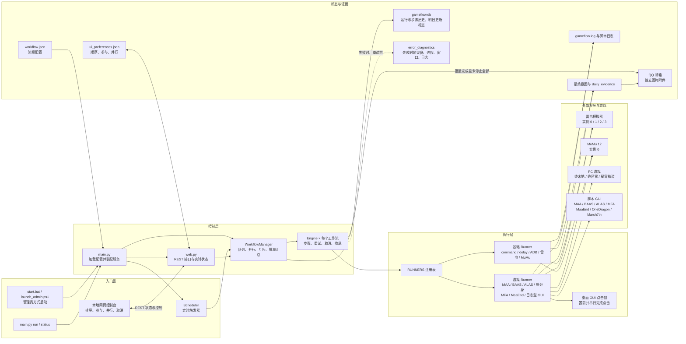

## 3. 每日队列、并行和互斥规划图

网页保存任务顺序、每个任务是否参加每日流程以及最大并行数。开始每日流程后，调度器按顺序建立 `pending` 队列，但队首若与当前任务互斥，会继续寻找后面的兼容任务。

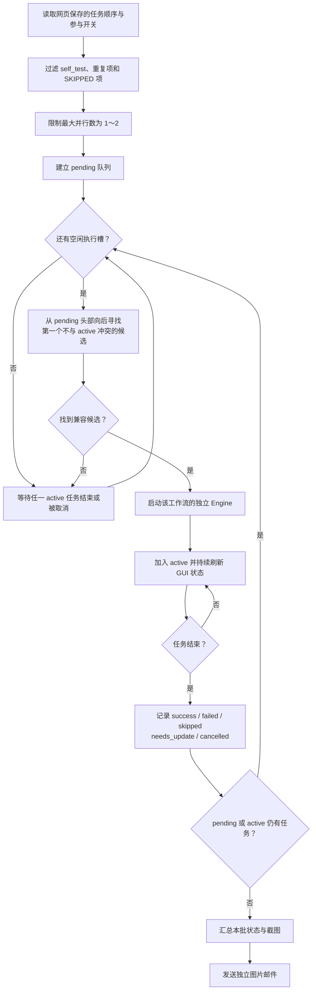

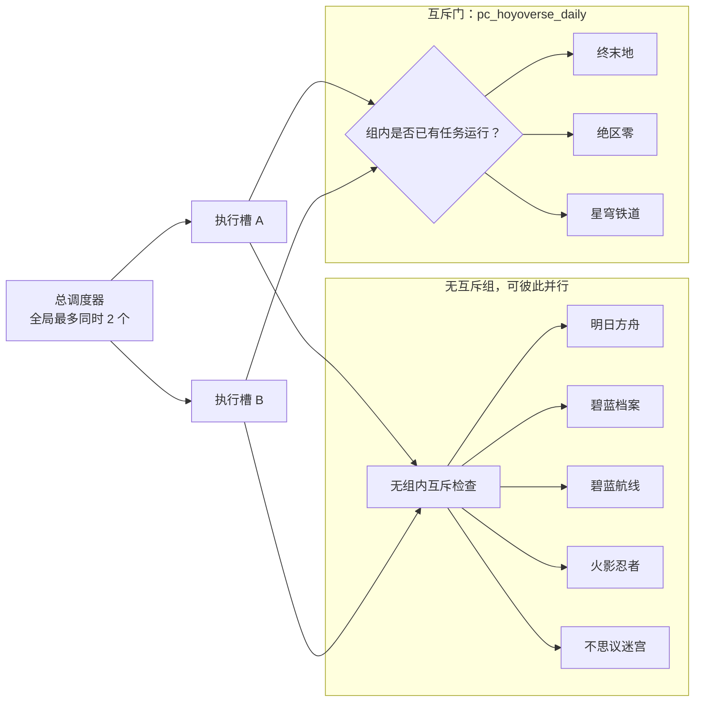

并行关系如下：

| 组合 | 是否允许 | 原因 |
|---|---:|---|
| 两个模拟器类任务 | 是 | 不在互斥组内，且未超过总并行上限 |
| 一个模拟器类任务 + 一个 PC 游戏任务 | 是 | PC 互斥只约束组内成员 |
| 终末地 + 绝区零 | 否 | 同属 `pc_hoyoverse_daily` |
| 终末地 + 星穹铁道 | 否 | 同属 `pc_hoyoverse_daily` |
| 绝区零 + 星穹铁道 | 否 | 同属 `pc_hoyoverse_daily` |
| 任意三个任务同时运行 | 否 | 总并行上限为 2 |

即使两个工作流并行，桌面脚本的“窗口置前 + 点击”也会通过全局点击锁依次完成，避免两个 GUI 同时争夺鼠标焦点。

## 4. 通用工作流生命周期

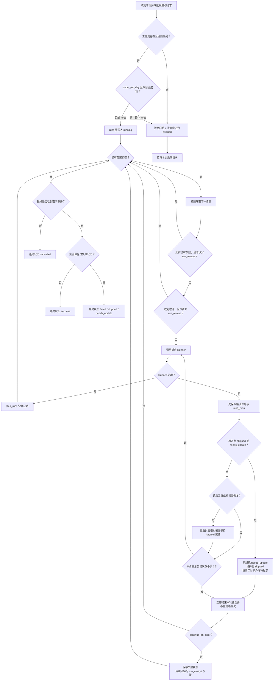

更新或维护会在当前 Runner 内立即形成明确状态并保存现场，不会继续尝试启动点击。用户取消后，Engine 会改用独立的清理上下文执行 `run_always` 步骤，因此取消事件不会再次打断最终截图和模拟器、脚本清理。普通失败在本步骤局部尝试耗尽后，仍由全局机制完整重跑一次工作流。

### 今日状态模型

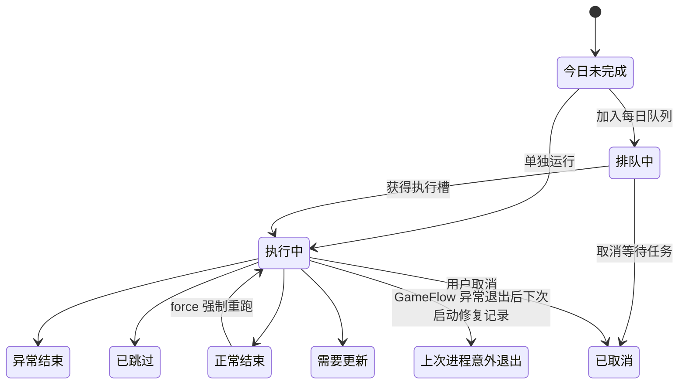

凌晨 04:00 切换到新的游戏日，GUI 的当日运行状态和上一批徽标重新从 `pending` 开始计算；任务顺序、最大并行数和“每日启动/SKIPPED”参与偏好继续保留。

## 5. 八个游戏的当前流程

### 5.1 总流程对照表

八个流程都配置了各自的精确更新和维护标志：更新统一返回 `needs_update`，维护统一返回 `skipped`，两者都会立即结束本轮主任务、留存证据并安排下一个游戏日启动时额外等待10分钟。所有启动点击、启动确认和启动后日志停滞也都有明确上限。

| 工作流 | 启动链 | 核心完成判定 | 异常与恢复 | 最终证据和清理 |
|---|---|---|---|---|
| 明日方舟 | 雷电 1 → ADB `emulator-5556` → MAA | MAA 本轮日志出现 `AllTasksCompleted` | 黑屏5分钟重启模拟器；启动最多点6次；启动后日志静默上限10分钟 | ADB 截图 `final.png` → 关闭雷电 1 |
| 碧蓝档案 | 雷电 3 → ADB `emulator-5560` → 管理员 BAAS | 本轮工作证据成立，且 BAAS 队列稳定为空10秒 | 忙碌或队列未知时禁止盲点；黑屏、日志停滞、ATX卡死和重复探测均有限恢复 | 工作任务奖励核验 → `blue_archive_final.png` → 关闭雷电 3 |
| 碧蓝航线 | MuMu 0 / ADB `127.0.0.1:16384` → ALAS | 本轮先出现 `Scheduler: Start task`，再出现 `No task pending`，并静默20秒 | 启动最多点5次；启动后日志静默上限10分钟；ADB/模拟器错误有限恢复 | 重连 ALAS ADB → `azur_lane_final.png` → 关闭 MuMu 0 |
| 火影忍者 | 雷电 0 → ADB `emulator-5554` → 影分身 | 确认浮窗进入终止态，识别大厅后计时5400秒 | 横竖屏、继续弹窗和浮窗操作均限制点击次数；黑屏有限恢复 | `naruto_final.png` → 关闭雷电 0 |
| 不思议迷宫 | 雷电 2 → ADB `emulator-5558` → MFAAvalonia | 每轮先有“用户操作：启动任务”，再有“任务已全部完成！”，共两轮 | 首次延迟2分钟；每轮启动最多3次；业务日志静默10分钟后最多重启脚本1次 | `gumballs_final.png` → 关闭雷电 2 |
| 终末地 | MaaEnd → 置前 `Endfield.exe` | 收尾切到 `Dummy Controller`，并确认最终任务提交日志 | 启动最多点10次；框架日志停滞、信用菜单和每日操作均有限恢复 | Runner 保存 `endfield_final.png` → 关闭游戏和 MaaEnd |
| 绝区零 | OneDragon → 点击“启动一条龙” → 置前游戏 | 日志出现“一条龙执行成功、全部结束” | 启动最多点20次；启动后日志静默上限10分钟；状态停滞有限恢复 | 活跃度/奖励标志时保存 `zenless_final.png` → 关闭游戏 |
| 星穹铁道 | March7th `main -e` → 公告检查 → 点击“完整运行” | 仅“每日实训已完成”可完成；“每日实训未完成”具有否决权 | 启动最多20次；新版本公告直接按 `needs_update` 结束，不点击“好的”继续更新 | 完成或奖励证据时保存 `star_rail_final.png` → 关闭游戏 |

### 5.2 模拟器类游戏

```mermaid
flowchart LR
    subgraph AK["明日方舟"]
        AK1["雷电 1"] --> AK2["ADB 就绪并稳定 60 秒"]
        AK2 --> AK3["置前 MAA 并启动任务"]
        AK3 --> AK4["AllTasksCompleted"]
        AK4 --> AK5["最终截图"]
        AK5 --> AK6["关闭雷电 1"]
    end

    subgraph BA["碧蓝档案"]
        BA1["雷电 3"] --> BA2["ADB 就绪"]
        BA2 --> BA3["管理员方式启动 BAAS"]
        BA3 --> BA4["本轮工作证据 + 队列稳定为空"]
        BA4 --> BA5["进入工作任务页核验奖励"]
        BA5 --> BA6["最终截图"]
        BA6 --> BA7["关闭雷电 3"]
    end

    subgraph AL["碧蓝航线"]
        AL1["启动并确认 MuMu 0"] --> AL2["启动 ALAS 并点击启动"]
        AL2 --> AL3["Start task → No task pending"]
        AL3 --> AL4["重连 ADB 并截图"]
        AL4 --> AL5["关闭 MuMu 0"]
    end

    subgraph N["火影忍者"]
        N1["雷电 0"] --> N2["启动影分身"]
        N2 --> N3["继续 / 启动功能"]
        N3 --> N4["识别并点击悬浮窗"]
        N4 --> N5["点击衍生启动并确认终止态"]
        N5 --> N6["识别大厅后等待 90 分钟"]
        N6 --> N7["最终截图并关闭雷电 0"]
    end

    subgraph G["不思议迷宫"]
        G1["雷电 2 + MFA"] --> G2["等待 2 分钟"]
        G2 --> G3["第 1 轮：启动 → 完成"]
        G3 --> G4["第 2 轮：启动 → 完成"]
        G4 --> G5["最终截图并关闭雷电 2"]
    end
```

### 5.3 PC 游戏互斥组

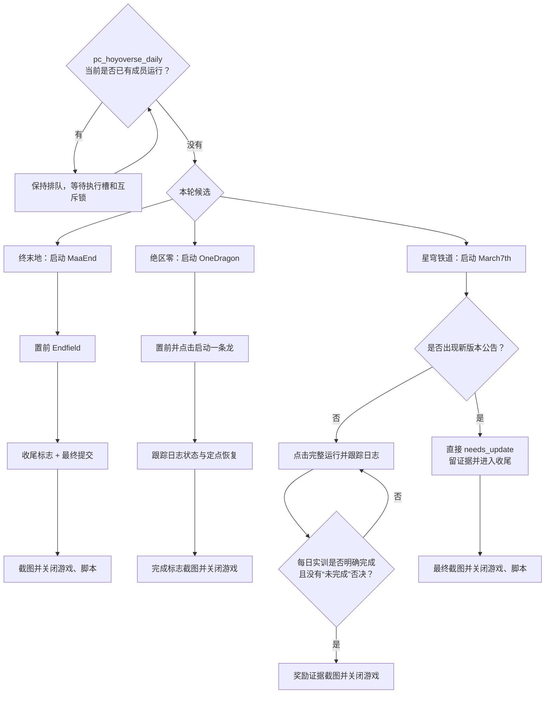

## 6. 碧蓝档案详细状态图

这是当前判断条件最多的流程。BAAS 的“任务全部执行成功”只是候选证据；主步骤必须确认本轮确实工作过并且队列稳定为空，随后再核验游戏内工作任务奖励。

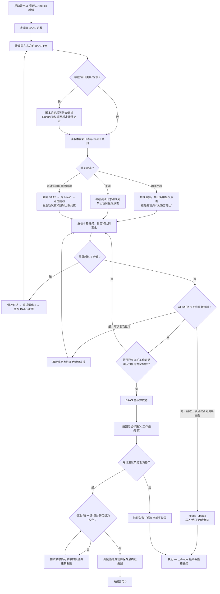

碧蓝档案的三项成功条件：

1. 本轮出现新的任务开始、成功日志或有效队列变化，不能沿用历史完成记录。
2. `baas1` 队列稳定为空；队列忙碌或未知时均禁止备用坐标点击。
3. 游戏内每日任务进度满格，并且“领取”和“一键领取”按钮最终都变灰。

## 7. 黑屏、更新、维护和错误证据链

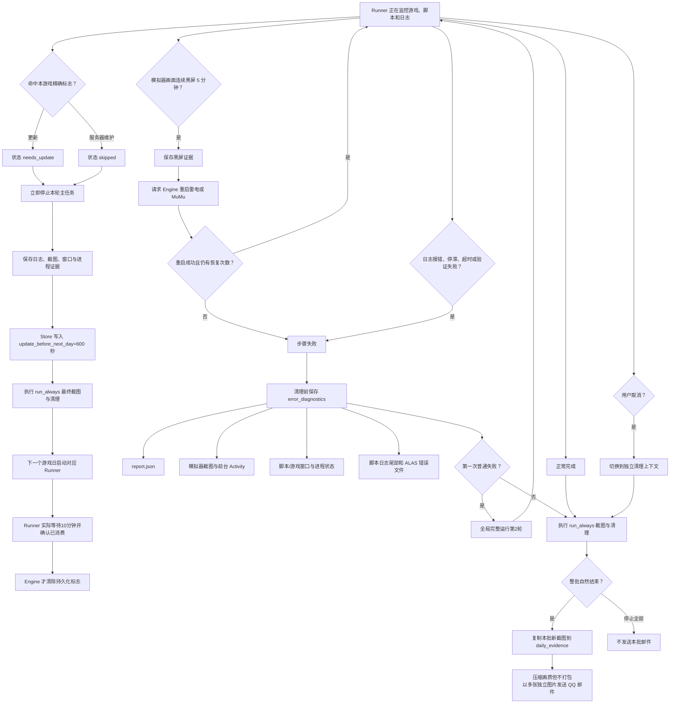

八个流程的更新与维护都返回 `defer_update_next_day`。Engine 只负责把等待时间交给 Runner；只有 Runner 返回 `_startup_update_wait_consumed`，才会清除“明日更新”标志。若启动、取消或异常发生在等待真正完成之前，标志会保留到下一次运行。

## 8. 代码职责规划图

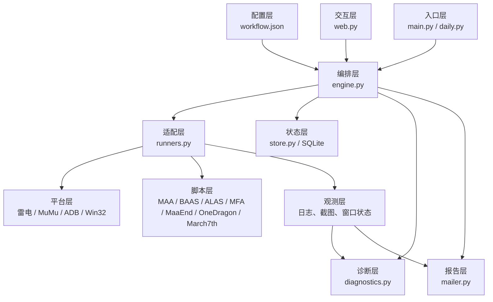

| 文件 | 应负责 | 不应承载 |
|---|---|---|
| `workflow.json` | 路径、坐标、标志、阈值、超时、步骤顺序 | 通用调度算法 |
| `engine.py` | 生命周期、重试、互斥、取消、状态汇总 | 某个游戏页面的点击细节 |
| `runners.py` | 平台和游戏适配、日志/画面判定 | 网页布局与任务排序偏好 |
| `web.py` | 展示、用户操作、偏好保存、API | 游戏完成判定 |
| `store.py` | 历史、游戏日、持久化标志 | 外部程序控制 |
| `diagnostics.py` | 失败瞬间的统一证据采集 | 改变游戏流程结果 |
| `mailer.py` | 收集本批新截图并发送 | 决定工作流是否成功 |

## 9. 已实现的可靠性基线与后续规划

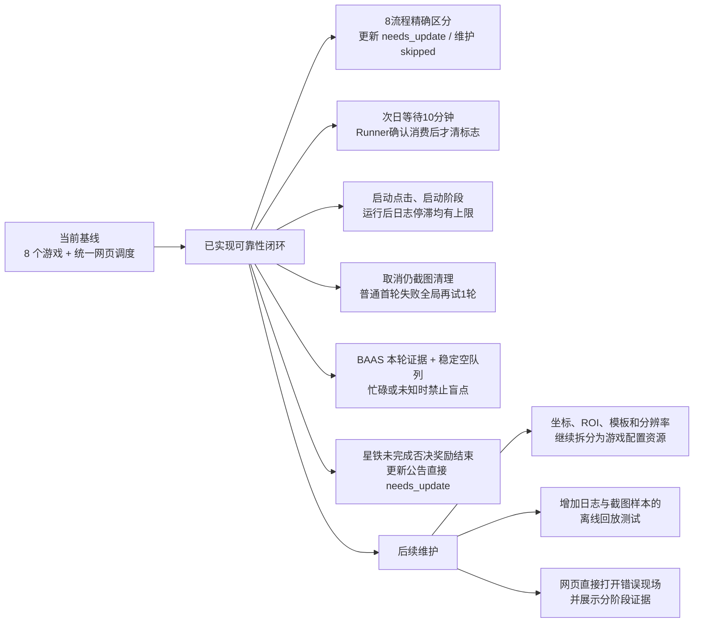

### 已从当前代码确认的实现注意点

1. 八个工作流对应的 Runner 都会接收 `startup_update_wait`；等待未真正完成时，“明日更新”标志不会被提前清除。
2. 星穹铁道的新版本公告直接结束为 `needs_update`，不会点击“好的”继续更新；“每日实训未完成”优先于奖励截图标志。
3. `naruto_reward_verify` Runner 仍存在于代码中，但当前 `naruto_daily` 配置没有使用它；当前火影流程是识别大厅后等待5400秒，再截图并关闭模拟器。
4. 八个游戏的定时触发器目前全部关闭，当前主要入口仍是网页、命令行或批处理文件。
5. “每日启动/SKIPPED”是持久化参与偏好，不会在凌晨04:00自动改回启用；凌晨04:00刷新的是今日执行状态和批次结果。
6. `pc_hoyoverse_daily` 是互斥组内部名称，成员为终末地、绝区零和星穹铁道。

## 10. 修改流程时的核对清单

新增或修改游戏流程时，应同时核对：

- 启动：程序路径、权限、模拟器实例、ADB 地址、游戏窗口置前。
- 开始确认：不能只点击按钮，必须有日志、按钮状态或浮窗状态证明已启动。
- 心跳：明确日志多久不更新才算停滞，避免脚本正常等待时被提前结束。
- 完成：必须使用本轮新增日志或当前画面，不能把旧日志当作本轮完成。
- 奖励：重要奖励应有单独页面验证与最终截图，而不是只相信脚本完成标志。
- 更新与维护：区分 `needs_update`、维护 `skipped` 和普通 `failed`。
- 黑屏：超过 5 分钟保存证据，最多重启一次模拟器，再重跑当前脚本步骤。
- 收尾：截图和关闭步骤使用 `run_always`，取消和失败也要清理外部程序。
- 并行：确认是否需要加入互斥组，且桌面 GUI 点击必须经过置前和全局点击锁。
- 测试：至少覆盖正常日志、旧日志、停滞、黑屏、更新、取消和第二轮重试。
